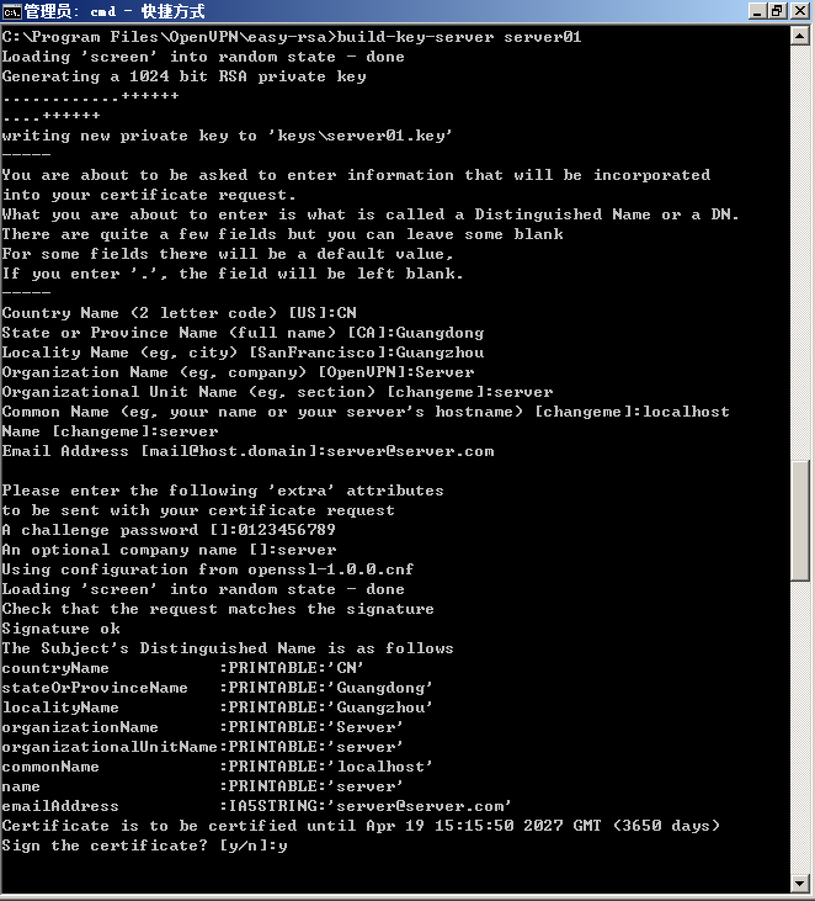

> 已完结

<!-- more -->


修改`C: \Program File\OpenVPN\easy-rsa`下的`openssl-1.0.0.cnf`文件

```
# PKIX recommendations harmless if included in all certificates.
subjectKeyIdentifier=hash
authorityKeyIdentifier=keyid,issuer:always
extendedKeyUsage=clientAuth
keyUsage = digitalSignature
# 需要添加的
extendedKeyUsage = emailProtection, serverAuth, clientAuth
```

否则不能在电子邮件中使用

以管理员身份运行 cmd 进到命令行窗口，cd 切到 `C: \Program File\OpenVPN\easy-rsa` 目录，然后依次运行以下三个命令：

```
init-config
vars
clean-all
```


key目录被清空并初始化


运行命令

```
build-ca
```

输入一些信息后（如图）生成CA证书和私钥


运行命令

```
build-dh
```


输入命令

```
build-key email0
```

使用自颁发CA给客户颁发证书


生成了该客户的证书、证书请求、私钥


由于windows不能直接导入.key私钥需要使用下列工具进行转换
https://ssl4less.eu/ssl-tools/convert-certificate.html#certificateConverter


得到.pfx文件，把ca.crt、email0.crt、email0.crt.pfx文件复制到发送邮件的机器上


1、导入CA证书

打开ca.crt，点击安装证书，将证书放入**受信任的根证书颁发机构**其他默认，安装完成后可以在certmgr中的”受信任的根证书颁发机构“看到该证书


2、导入私钥
打开email0.crt.pfx，其中一步需要输入密码，密码为转换时设置的密码，将证书放入**个人**


3、导入证书
打开email0.crt，安装证书，将证书放入**个人**。安装完成后可以在certmgr中的”个人“看到该证书。打开该证书可以看到该证书有一个与之对应的私钥


4、对邮件进行签名

打开outlook，新建邮件，点击下图所示的按钮


点击安全设置，勾选**为此文件添加数字签名**


再点击更改设置，选择签名证书，会自动选择刚刚导入的证书


保存设置，发送该邮件

收件方收到邮件后，点击如图所示位置，可以看到签名


---
输入命令

```
build-key client01
build-key-server server01
```

分别创建客户端证书和服务端证书




生成的文件


使用OpenSSL生成的数字证书和私钥，如需要在Java或Tomcat环境下使用，需要先装其转换成PKCS#12编码格式的密钥库，才能使用keytool工具进行相应的管理。


输入命令

```
keytool -keystore truststore.jks -keypass 0123456789 -storepass 0123456789 -alias ca -import -trustcacerts -file D:\tomcat\cert\ca.crt
```

使用ca证书生成java keystore文件truststore.jks


把truststore.jks和server01.p12放入tomcat根目录中

编辑conf\server.xml，加入下列代码

```xml
<Connector port="8443" protocol="HTTP/1.1" SSLEnabled="true"
               maxThreads="150" scheme="https" secure="true"
               clientAuth="true" sslProtocol="TLS"
               keystoreFile="server01.p12" keystoreType="pkcs12" keystorePass="0123456789"
               truststoreFile="truststore.jks" truststoreType="JKS" truststorePass="0123456789" />
```


注释以下代码

```
<Listener className="org.apache.catalina.core.AprLifecycleListener" SSLEngine="on" />
```

运行tomcat，访问https:\\localhost:8443


