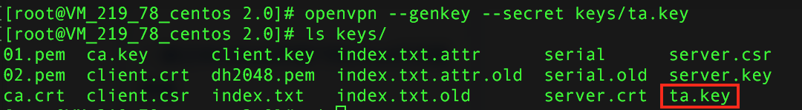
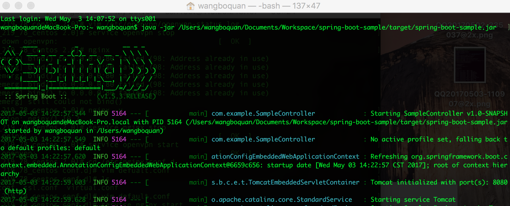

> 已完结

<!-- more -->

# 1 准备工作
安装openvpn和easy-rsa

```shell
#yum install openvpn easy-rsa
```

将相关文件复制到 OpenVPN 的配置目录:

```shell
#cp -R /usr/share/easy-rsa/ /etc/openvpn
```
现在有关的文件都在`/etc/openvpn/easy-rsa/2.0/`这个目录中

修改vars

```shell
#vim /etc/openvpn/easy-rsa/2.0/vars
```

将以下这些值修改成你自己的值:

```shell
export KEY_COUNTRY="CN"
export KEY_PROVINCE="Guangdong"
export KEY_CITY="Guangzhou"
export KEY_ORG="YZZN"
export KEY_EMAIL="info@i-mec.com"
export KEY_CN=droplet.example.com

export KEY_SIZE=2048   #默认密钥长度为 1024,建议为 2048
export CA_EXPIRE=3650  #默认 CA 证书和私钥有效期为 3650 天
export KEY_EXPIRE=3650 #默认服务器/客户端证书和私钥有效期为 3650 天
```


修改完成后执行

```shell
#cd /etc/openvpn/easy-rsa/2.0
#source ./vars
#./clean-all
```


# 2 生成证书
## 2.1 构建 CA 私钥和自签发证书

执行

```shell
# ./build-ca
```

CN字段填CA其他默认


## 2.2 签发服务器证书和私钥

```shell
# ./build-key-server server
```


## 2.3 生成 SSL 协议所需的 Diffie Hellman key exchange 参数

```shell
# ./build-db
```

## 2.4 生成客户端证书和密钥

```shell
# ./build-key client
```


## 2.4 生成ta.key文件（防DDos攻击、UDP淹没等恶意攻击）

```shell
# openvpn --genkey --secret keys/ta.key
```

至此在`keys`文件夹下生成了所有我们需要的文件




# 3 配置openvpn服务器

把配置文件模板复制到openvpn配置目录下

```shell
# cp /usr/share/doc/openvpn-2.4.1/sample/sample-config-files/server.conf /etc/openvpn
```

编辑server.conf，修改为以下内容

```
port 1194
proto udp
dev tun

ca /etc/openvpn/easy-rsa/2.0/keys/ca.crt
cert /etc/openvpn/easy-rsa/2.0/keys/server.crt
key /etc/openvpn/easy-rsa/2.0/keys/server.key
dh /etc/openvpn/easy-rsa/2.0/keys/dh2048.pem

server 10.8.0.0 255.255.255.0

ifconfig-pool-persist ipp.txt

# 可以让客户端之间相互访问直接通过openvpn程序转发，根据需要设置
client-to-client
# 如果客户端都使用相同的证书和密钥连接VPN，一定要打开这个选项，否则每个证书只允许一个人连接VPN
duplicate-cn

keepalive 10 120

tls-auth /etc/openvpn/easy-rsa/2.0/keys/ta.key 0

cipher AES-256-CBC
comp-lzo
persist-key
persist-tun
status openvpn-status.log
verb 3
explicit-exit-notify 1
```
2.4 配置内核和防火墙，启动服务

（1）执行以下命令开启路由转发功能
sed -i '/net.ipv4.ip_forward/s/0/1/' /etc/sysctl.conf
sysctl -p

（2）执行以下命令配置防火墙
iptables -I INPUT -p tcp --dport 1194 -m comment --comment "openvpn" -j ACCEPT
iptables -t nat -A POSTROUTING -s 10.8.0.0/24 -j MASQUERADE
service iptables save

（3）执行以下命令启动openvpn并设置为开机启动
service openvpn start
chkconfig openvpn on


# 4 客户端配置

从`/etc/openvpn/easy-rsa/2.0/keys`中下载以下文件：

```
ca.crt
client.crt
client.key
ta.key
```

从openvpn的配置模板文件夹`/usr/share/doc/openvpn-2.4.1/sample/sample-config-files/`中下载客户端配置文件client.conf

修改client.conf为以下内容

```
client
dev tun
proto udp
remote 119.29.245.107 1194
resolv-retry infinite
nobind
persist-key
persist-tun
ca ca.crt
cert client.crt
key client.key
remote-cert-tls server
tls-auth ta.key 1
cipher AES-256-CBC
comp-lzo
verb 3
```

重命名为client.ovpn

下载mac平台下openvpn的客户端Tunnelblick，安装后打开client.ovpn，客户端会自动加载配置，点击连接client，客户端控制台显示成功连接到openvpn服务器，同时可以看到本机的vlan地址是10.8.0.6


可以ping通openvpn服务器


查看openvpn服务器的日志文件，可以看到客户端连接的记录


2 反向代理

在openvpn上安装nginx

```
yum install nginx
```

3、配置nginx
进入/etc/nginx/conf.d，修改defualt.conf文件

```
server {
    listen 80;
    server_name 127.0.0.1;

    location / {
        proxy_pass http://10.8.0.6:8080;
    }
}
```

在本机上用Tunnelblick连接到openvpn服务器加入到vlan中，然后启动一个web应用



使用另一台处于外网的设备访问openvpn服务器的地址，发现可以访问本机的web应用


