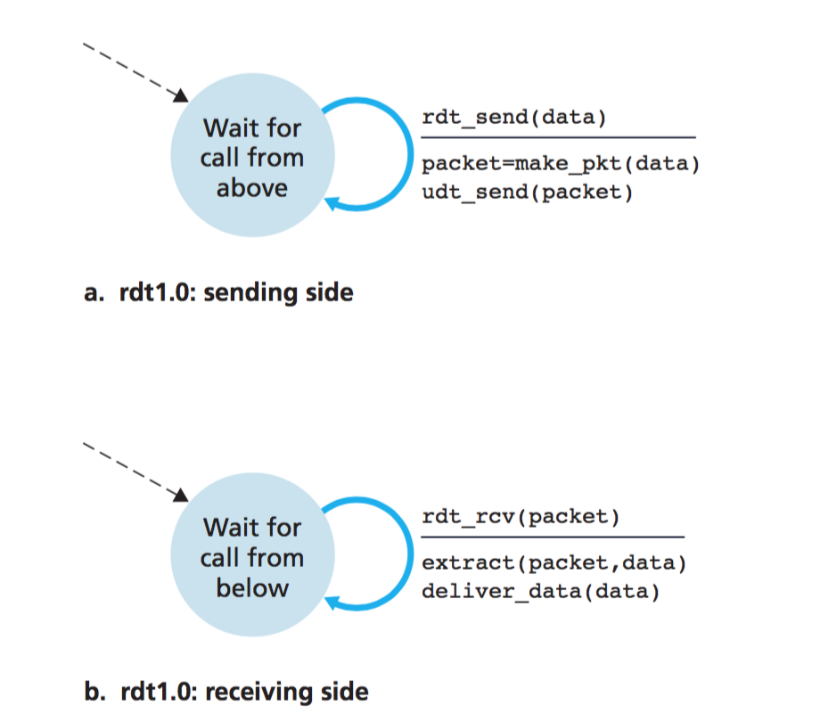
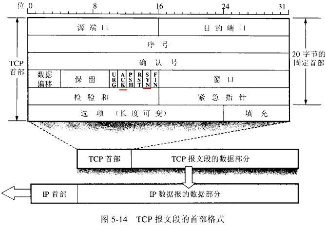
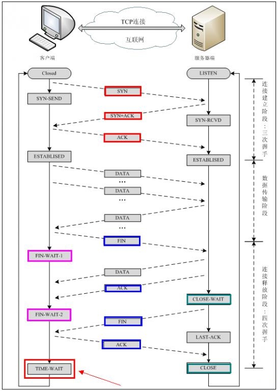

> 连载中

<!-- more -->

# 运输层：
多路复用：将运输层报文段中的数据交付到正确的socket
多路分解：在源主机从不同的socket中收集数据块，并为每个数据块封装上首部信息从而生成报文段，然后将报文段传递到网路层

报文段（32）=源端口号（16）+目的端口号（16）+其他部首字段（32）+报文

## UDP
UDP报文段 = 源端口号+目的端口号+长度+检验和+报文

UDP检验和：对报文段每16bits相加，若有溢出把溢出位加到最后一位（回卷），再取反
如果接收方把所有16bits字相加（包括检验和）结果全为1，则没有差错

## 可靠传输协议（rdt）
### rdt 1.0
假设底层信道完全可靠，发送端和接收端只用负责封装数据和拆封数据

### rdt 2.0
问题：在底层信道中分组中的比特可能受损
解决方法：自动重传请求协议（ARQ）
具体过程：一开始发送方处于**等待来着上层调用**的状态，当发送方需要发送数据时，会构造一个包含待发送数据和检验和的一个分组，然后发送出去，随后发送方进入**等待ACK（肯定确认）或NAK（否定确认）**的状态。如果发送方收到ACK，则回到一开始的状态，如果收到NAK，则重传分组。
接收方收到的数据如果没有受损，则回答ACK，否则回答NAK。
由于发送方在收到回应之前不能继续发送数据，所以rdt 2.0这样的协议又被称为**停等协议**

### rdt 2.1
问题：ACK和NAK可能受损
解决方法：在数据分组中增加**序号**（sequence number）字段
具体过程：
发送方
状态A：等待上层调用，发送0号分组
状态B：等待ACK或NAK，期望收到0号分组
状态C：等待上层调用，发送1号分组
状态D：等待ACK或NAK，期望收到1号分组
A -> B：被调用后，封装编号0，数据，检验和为一个分组，发送出这个分组，进入B状态
B -> B：收到了回答但是分组损坏或者收到NAK，重传分组
B -> C：收到了ACK且分组没有损坏，进入C状态
C -> D：被调用后，封装编号1，数据，检验和为一个分组，发送出这个分组，进入D状态
D -> D：收到了回答但是分组损坏或者收到NAK，重传分组
D -> A：收到了ACK且分组没有损坏，进入A状态

接收方：
状态A：等待上层调用，期望收到0号分组
状态B：等待上层调用，期望收到1号分组
A -> B：收到分组且分组没有损坏且序号为0，返回含有ACK和检验和的分组
A -> A：收到分组但分组损坏，返回含有NAK和检验和的分组
A -> A：收到分组且分组没有损坏，但序号为1，丢弃数据，返回含有ACK和检验和的分组
B -> A：收到分组且分组没有损坏且序号为1，返回含有ACK和检验和的分组
B -> B：收到分组但分组损坏，返回含有NAK和检验和的分组
B -> B：收到分组且分组没有损坏，但序号为0，丢弃数据，返回含有ACK和检验和的分组

### rdt 2.2
改进rdt 2.1，使用冗余ACK代替NAK，ACK中必须带有编号
具体过程：
发送方
状态A：等待上层调用，发送0号分组
状态B：等待ACK 0
状态C：等待上层调用，发送1号分组
状态D：等待ACK 1
A -> B：被调用后，封装编号0，数据，检验和为一个分组，发送出这个分组，进入B状态
B -> B：收到了回答，但是分组损坏或者收到ACK 1，重传分组
B -> C：收到了ACK 0且分组没有损坏，进入C状态
C -> D：被调用后，封装编号1，数据，检验和为一个分组，发送出这个分组，进入D状态
D -> D：收到了回答，但是分组损坏或者收到ACK 0，重传分组
D -> A：收到了ACK且分组没有损坏，进入A状态

接收方：
状态A：等待上层调用，期望收到0号分组
状态B：等待上层调用，期望收到1号分组
A -> B：收到分组且分组没有损坏且序号为0，返回含有ACK和检验和的分组
A -> A：收到分组且分组没有损坏，但序号为1，丢弃数据，返回含有ACK 1和检验和的分组
B -> A：收到分组且分组没有损坏且序号为1，返回含有ACK和检验和的分组
B -> B：收到分组且分组没有损坏，但序号为0，丢弃数据，返回含有ACK 0和检验和的分组

### rdt 3.0
问题：丢包
解决方法：倒计数定时器
具体过程：
发送方
状态A：等待上层调用，发送0号分组
状态B：等待ACK 0
状态C：等待上层调用，发送1号分组
状态D：等待ACK 1
A -> B：被调用后，封装编号0，数据，检验和为一个分组，发送出这个分组，定时器启动
A -> A：收到了分组，无视
B -> B：收到了回答，但是分组损坏或者收到ACK 1，继续等待
B -> B：时间到，重传分组，定时器重新启动
B -> C：收到了ACK 0且分组没有损坏，定时器停止，进入C状态
C -> D：被调用后，封装编号1，数据，检验和为一个分组，发送出这个分组，进入D状态
C -> C：收到了分组，无视
D -> D：收到了回答，但是分组损坏或者收到ACK 0，继续等待
D -> D：时间到，重传分组，定时器重新启动
D -> A：收到了ACK且分组没有损坏，定时器停止，进入A状态

接收方：同rdt 2.2

### 流水线rdt
问题：rdt 3.0存在性能问题，利用率过低，原因在于它是个等停协议
解决方法：不使用等停协议，允许发送方发送多个分组而无需等待确认
带来的影响：

* 必须增加序号范围
* 协议的发送方和接收方必须缓存多个分组
* 如何处理丢失、损坏及延时过大的分组

解决流水线的差错恢复有两种方法：**退回N步（GBN）**和**选择重传（SR）**
#### GBN
GBN允许发送方发送多个分组而不需要等待确认，但它受限于在流水线中未确认的分组数不能超过某个最大允许数N

GBN又被称为**滑动窗口协议**

基数号（base）：最早未确认分组的序号
下一个序号（nextseqnum）：最小未使用序号（即下一个待发送的序号）
N：窗口长度

[0, base-1]：已经发送并确认
[base, nextseqnum-1]：已经发送未确认
[nextseqnum, base+N-1]：即将发送
[base+N-1, ∞)：不能使用

序号范围[0, 2^k - 1]（rdt3.0中为[0,1]）

所有序号必须使用模2^k运算以保证在范围之内

具体过程：
发送方

* **有上层调用时**：如果nextseqnum<base+N，即窗口未满，则产生一个分组并发送，然后更新相应变量；否则将数据返回上层，暗示上层窗口已满。
* **收到一个ACK**：在GBN中，对序号为n的分组的确认采用**累积确认**的方式，表明接收方已正确收到序号为n的以前且包括n在内的所有分组
* **超时**：重传所有已发送但未确认的分组

接收方

* 如果一个序号为n的分组被正确接收到，并且按序，则接收方为分组n发送一个ACK
* 其他情况下，丢弃该分组，并为最近按序接收的分组重新发送ACK

#### SR
问题：可能发生大量分组重传而导致性能问题
解决方法：仅重传那些它怀疑在接收方出错的分组
具体过程：
发送方

* **有上层调用时**：如果nextseqnum<base+N，即窗口未满，则产生一个分组并发送，然后更新相应变量；否则将数据返回上层，暗示上层窗口已满。
* **收到一个ACK**：如果分组序号在窗口内，则将那个被确认的分组标记为已接收。如果该分组的序号等于send_base，则窗口基序号向前移动到第一个未确认分组处。如果窗口移动了且有序号落在窗口内未发送，则发送这些分组
* **超时**：由于每个分组都有自己的定时器，所以只重传超时的分组

接收方

* 序号在[rcv_base, rcv_base+N-1]内的分组被正确接收在此情况下，收到的分组落在接收方的窗口内，返回ACK。如果该分组以前没有收到，则缓存该分组；如果该分组的序号等于接收窗口的基序号（rcv_base），则该分组以及之前缓存的序号连续的分组交付给上层。
* 序号在[rcv_base-N, rcv_base-1]内分组被正确收到，即使是接收方以前已确认的分组，也必须产生一个ACK
* 其他情况下，丢弃该分组

## 拥塞控制
拥塞代价

1. 分组到达速率接近链路容量时，排队延时巨大
2. 发送方必须重传以补偿因为缓存溢出而丢弃的分组
3. 发送方在遇到大延时时所进行的不必要重传会引起路由器利用其链路带宽来转发不必要的分组副本
4. 当一个分组沿一条路径被丢弃时，每个上游路由器用于转发该分组到丢弃该分组而使用的传输容量最终被浪费了

方法

1. 端到端拥塞控制
2. 网络辅助拥塞控制

网络辅助拥塞控制例子：ATM ABR拥塞控制

## TCP
                                                                                                                                                                                                                                                                                                                                                                                                                                                                                                                                                                                                                                                                                                                                                                                                                                                                                                                                                                                                                                                                                                                                                                                                                                                                                                                                                                                                                                                                                                                                                                                                                                                                                                                                                                                                                                                                                                                                                                                                                                                                                                                                                                                                                                                                                                                                                                                                                                                                                                                                                                                                                                                                                                                                                                                                                                                                                                                                                                                                                                                                                                                                                                                                                                                                                                                                                                                                                                                                                                                                            
（计算机网络第6版 图3-29）
32bit序号（seq）和32bit确认号（ack）：实现**可靠数据传输服务**
16bit接收窗口字段：用于**流量控制**
4bit数据偏移（部首长度）：指示以32bit的字为单位的TCP部首长度
6bit标志位字段：URG+ACK+PSH+RST+SYN+FIN

ACK：acknowledgement TCP协议规定，只有ACK=1时有效，也规定连接建立后所有发送报文的ACK必须为1
SYN：synchronization 在连接建立时用来同步序号。当SYN=1而ACK=0时，表明这是一个连接请求报文。对方若同意建立连接，则应在响应报文中使SYN=1和ACK=1. 因此,  SYN置1就表示这是一个连接请求或连接接受报文。
FIN：final 用来释放一个连接。当FIN=1时，表明此报文段的发送方的数据已经发送完毕，并要求释放连接。
RST：
PSH：该位被设置时，接收方应立即将数据交给上层
URG：存在紧急数据

主机A填充进报文段的确认号是主机A**期望**从主机B收到的下一字节的序号

TCP提供**累积确认**

### TCP的可靠数据传输
TCP发送方的3个与发送和重传有关的事件：从上层应用程序接收数据、定时器超时和收到ACK

每次TCP重传时都会将下次的超时间隔设为先前值的两倍

快速重传：发送方一旦收到3个冗余ACK，就执行快速重传，即在该报文段的定时器过期之前重传丢失的报文段
选择确认：允许TCP接收方有选择的确认失序报文段

### 流量控制
TCP通过让发送方维护一个称为**接收窗口**的变量来提供流量控制

### TCP连接管理：三次握手和四次挥手
#### 三次握手

1. 首先由Client发出一个特殊的TCP报文段，该报文段SYN=1, ACK=0, seq=client_isn（client_isn由客户端随机生成），且不携带数据。该报文段被称为SYN报文段
2. Server接收到SYN报文段并分配资源后，向客户端发送允许连接的报文段。该报文段SYN=1, ACK=1, seq=server_isn, ack=client_isn+1（server_isn由服务端随机生成），且不携带数据。该报文段被称为SYNACK报文段
3. Client接收到SYNACK报文段并分配资源后，向Server发送另外一个报文段，确认服务器允许连接，该报文段SYN=0, seq=client_isn+1, ack=server_isn+1，因为连接已经建立，所以SYN置为0，在该报文段中可以携带数据。

一旦完成这三个步骤，Client和Server就可以进行数据交换了，此后每一个报文段中SYN都要置为0

形象的描述三次握手：
C:“喂，你听得到吗？”             C发送SYN
S:“我听得到呀，你听得到我吗？”     S发送SYN ACK
C:“我能听到你，今天balabala...”  C发送ACK并传输数据

#### 四次挥手

1. Client打算关闭连接，发送了一个特殊的报文段，该报文段中FIN=1
2. Server接收到该报文段后，向Client发送确认报文段ACK=1（该报文段仍包含数据）
3. Server随后发送自己的终止报文段（FIN=1）
4. Client收到后发送确认报文段，连接终止

形象的描述四次挥手：
C:“喂，我不说了。”                             C发送FIN
S:“我知道了。等下，上一句还没说完。Balabala...”   S发送ACK
S:”好了，说完了，我也不说了。”                   S发送FIN
C:”我知道了”                                  C发送ACK

C等待2MSL，保证S收到了消息，否则重传ACK

为什么连接的时候是三次握手，关闭的时候却是四次握手？
答：因为当Server端收到Client端的SYN连接请求报文后，可以直接发送SYN+ACK报文。其中ACK报文是用来应答的，SYN报文是用来同步的。但是关闭连接时，当Server端收到FIN报文时，很可能并不会立即关闭SOCKET，所以只能先回复一个ACK报文，告诉Client端，"你发的FIN报文我收到了"。只有等到我Server端所有的报文都发送完了，我才能发送FIN报文，因此不能一起发送。故需要四步握手。

为什么TIME_WAIT状态需要经过2MSL(最大报文段生存时间)才能返回到CLOSE状态？
答：虽然按道理，四个报文都发送完毕，我们可以直接进入CLOSE状态了，但是我们必须假象网络是不可靠的，有可以最后一个ACK丢失。所以TIME_WAIT状态就是用来重发可能丢失的ACK报文。

### TCP拥塞控制
TCP必须使用**端到端拥塞控制**而不是使用网络辅助拥塞控制，因为IP层不向端系统提供显式的网络拥塞反馈

方法：让每个TCP发送方根据感知到的网络拥塞程度来限制其发送速率。如果没什么拥塞，则加快速率；反之降低速率。

问题：如何限制速率；如何感知拥塞；如何改变速率

1、如何限制速率
TCP拥塞控制机制跟踪一个变量：拥塞窗口（cwnd）
在一个发送方中未确认的数据量不会超过cwnd与rwnd中的最小值
在理想情况下，发送方的发送速率大概是cwnd/RTT(Byte/s)，通过调节cwnd的值可以控制速率

2、如何感知拥塞
定义丢包事件：超时或收到3个ACK
发生丢包事件时，发送方就认为发生了拥塞3

3、如何改变速率

* 一个丢失的报文段意味着拥塞，因此当丢失报文段时应该降低TCP发送方的速率
* 当对先前未确认报文段的确认到达时，能够增加发送方的速率
* 带宽探测

#### TCP拥塞算法

1. 慢启动
在慢启动状态下，cwnd的值以一个MSS开始，并每当传输的报文段首次被确认就增加一个MSS。因此，TCP发送速率起始慢，但在慢启动阶段以指数增长。

何时停止：
（1）如果存在由超时引起的丢包事件，将ssthresh设置为cwnd/2，然后将cwnd设为1MSS并重新慢启动
（2）当cwnd=ssthresh时，结束慢启动进入拥塞避免模式
（3）当收到3个ACK时，进入快速恢复模式

2. 拥塞避免
每个RTT只将cwnd增加一个MSS

何时停止：
（1）如果存在由超时引起的丢包事件，将ssthresh设置为cwnd/2，然后将cwnd设为1MSS并重新慢启动
（2）当收到3个ACK时，将ssthresh设为cwnd/2，进入快速恢复模式

3. 快速恢复
对于引起TCP进入快速恢复模式的缺失报文段，对收到的每一个冗余ACK，cwnd的值增加一个MSS。最终当对丢失报文段的一个ACK到达时，TCP在降低cwnd后进入拥塞避免状态

何时停止：
（1）如果存超时，将ssthresh设置为cwnd/2，然后将cwnd设为1MSS并重新慢启动
（2）如果存在丢包，将ssthresh设为cwnd/2，cwnd设置为1MSS

### TCP有关变量
LastByteRead
LastByteSent
LastByteAcked
rwnd
